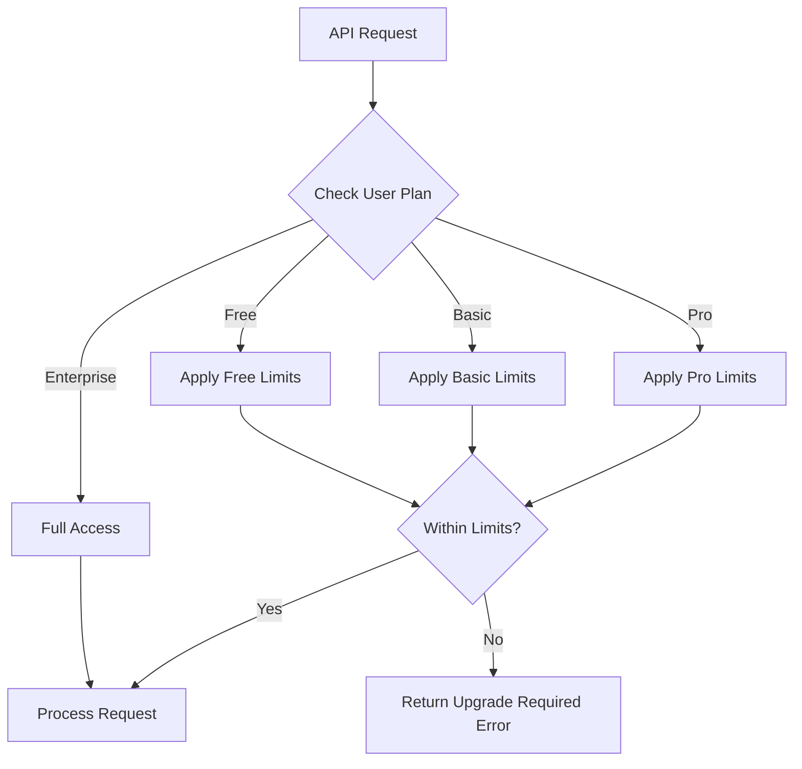
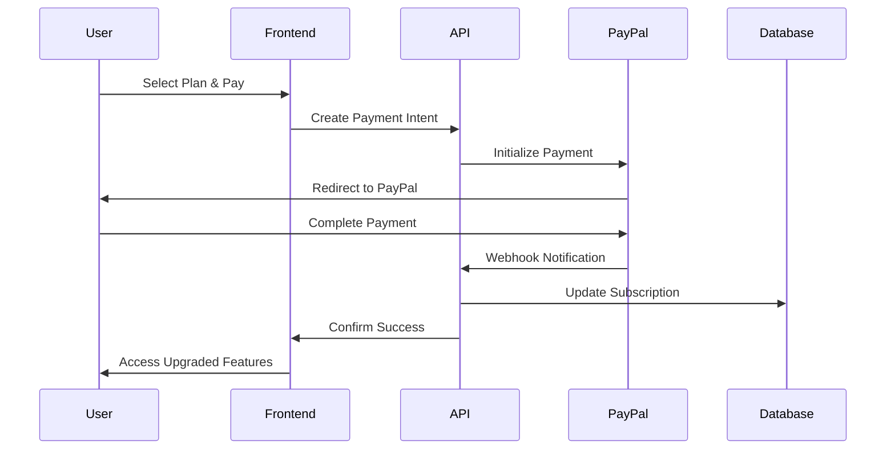
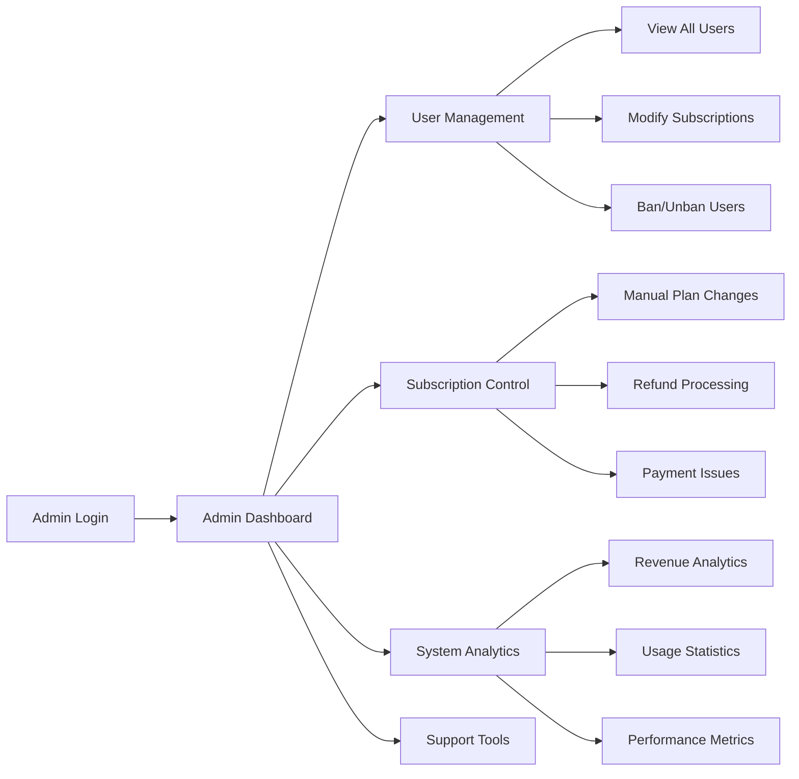

# 🚀 ResearchHub Business Logic Implementation Action Plan

**Date**: September 1, 2025  
**Status**: Implementation Ready  
**Priority**: Critical for Revenue Generation  

## 📋 Current State Analysis

### ✅ **What's Working Excellently**
- **UI/UX**: Professional, responsive design with excellent user experience
- **Authentication**: Robust role-based system (researcher/participant/admin)
- **Study Creation Flow**: Complete study builder with 13 block types
- **Core User Flow**: Steps 1-4 working (signup → create study → launch → browse)
- **Infrastructure**: React + TypeScript + Vite + Supabase + Vercel deployment

### ⚠️ **Critical Business Logic Gaps**
- **Plan Enforcement**: No subscription limits enforced (free users can access all features)
- **Payment Integration**: PayPal integration incomplete, no actual billing
- **Admin Functionality**: Mock data only, no real admin operations
- **Usage Tracking**: No monitoring of study limits, participant counts, or feature usage
- **Feature Gating**: All users have access to enterprise features regardless of plan

## 🎯 Implementation Requirements Overview

Based on testing analysis and existing architecture, we need to implement:

### **1. Subscription Plan Enforcement System**
```typescript
// Current State: UI exists but no enforcement
interface ISubscriptionFeatures {
  maxStudies: number;
  maxParticipantsPerStudy: number;
  recordingMinutes: number;
  advancedAnalytics: boolean;
  exportData: boolean;
  teamCollaboration: boolean;
  prioritySupport: boolean;
  customBranding: boolean;
}

// Need: Real-time enforcement in API calls
```

### **2. Payment Processing Integration**
```javascript
// Current State: Mock implementation
const mockSubscription = {
  id: 'sub_mock_12345',
  plan_id: plan_id,
  status: 'active'
};

// Need: Real PayPal, DodoPayments, STC Bank integration
```

### **3. Admin Dashboard Functionality**
```javascript
// Current State: Returns mock data
const mockSubscriptions = [
  { id: 'sub_1', plan: 'pro', status: 'active' }
];

// Need: Real database operations with admin controls
```

## 📊 Implementation Action Plan

### **Phase 1: Subscription Enforcement (Week 1)**

#### **Priority 1A: Plan Validation Middleware**


**Implementation Tasks:**
- [ ] Create `planEnforcementMiddleware.js` for API validation
- [ ] Add plan checking to study creation API
- [ ] Implement participant limit validation
- [ ] Add feature gating for advanced analytics
- [ ] Create upgrade prompts in frontend

#### **Priority 1B: Usage Tracking System**
```javascript
// Database Schema Addition
interface IUsageMetrics {
  userId: string;
  studiesCreated: number;
  participantsRecruited: number;
  recordingMinutesUsed: number;
  dataExports: number;
  lastResetDate: Date;
}
```

**Implementation Tasks:**
- [ ] Create `usage_metrics` table in Supabase
- [ ] Add usage tracking to study creation
- [ ] Implement monthly usage reset logic
- [ ] Create usage dashboard for users
- [ ] Add usage warnings before limits

### **Phase 2: Payment Integration (Week 2)**

#### **Priority 2A: PayPal Integration Completion**


**Implementation Tasks:**
- [ ] Complete PayPal SDK integration
- [ ] Implement webhook handling for payment confirmation
- [ ] Add subscription activation/deactivation logic
- [ ] Create billing history and invoices
- [ ] Add payment failure handling and retry logic

#### **Priority 2B: Multi-Payment Gateway Support**
**Implementation Tasks:**
- [ ] Finalize DodoPayments integration
- [ ] Complete STC Bank integration for Saudi market
- [ ] Add payment method selection UI
- [ ] Implement currency conversion
- [ ] Add payment security validation

### **Phase 3: Admin System Implementation (Weeks 3-4)**

#### **Priority 3A: Real Admin Operations**


**Implementation Tasks:**
- [ ] Replace mock admin API with real database operations
- [ ] Add user management functionality (ban, modify plans)
- [ ] Implement subscription override capabilities
- [ ] Create revenue and usage analytics
- [ ] Add support ticket system

#### **Priority 3B: System Monitoring & Analytics**
**Implementation Tasks:**
- [ ] Add real-time user activity monitoring
- [ ] Implement conversion funnel tracking
- [ ] Create automated plan upgrade suggestions
- [ ] Add churn prediction and retention tools
- [ ] Implement automated billing issue detection

## 🛠️ Technical Implementation Details

### **1. Plan Enforcement Architecture**
```javascript
// planEnforcementMiddleware.js
export const enforcePlanLimits = async (req, res, next) => {
  const { user } = req;
  const userPlan = await getUserSubscription(user.id);
  const usage = await getUserUsage(user.id);
  
  // Check specific limits based on action
  const action = req.body.action || req.query.action;
  const enforcementResult = await checkPlanLimits(userPlan, usage, action);
  
  if (!enforcementResult.allowed) {
    return res.status(402).json({
      success: false,
      error: 'Plan upgrade required',
      requiredPlan: enforcementResult.requiredPlan,
      currentUsage: usage,
      planLimits: enforcementResult.planLimits
    });
  }
  
  next();
};
```

### **2. Payment Processing Flow**
```javascript
// Complete PayPal Integration
const paypalClientId = process.env.PAYPAL_CLIENT_ID;
const paypalClientSecret = process.env.PAYPAL_CLIENT_SECRET;

const createPayPalPayment = async (planId, userId) => {
  const plan = SUBSCRIPTION_PLANS[planId];
  
  const payment = {
    intent: 'sale',
    payer: { payment_method: 'paypal' },
    transactions: [{
      amount: {
        total: plan.price,
        currency: 'USD'
      },
      description: `${plan.name} Subscription`
    }],
    redirect_urls: {
      return_url: `${process.env.APP_URL}/payment/success`,
      cancel_url: `${process.env.APP_URL}/payment/cancel`
    }
  };
  
  return await paypal.payment.create(payment);
};
```

### **3. Admin Dashboard Data Flow**
```javascript
// Real Admin API Implementation
const getAdminAnalytics = async (req, res) => {
  const { data: users } = await supabase
    .from('user_profiles')
    .select('*, subscriptions(*)');
    
  const { data: studies } = await supabase
    .from('studies')
    .select('*, user_profiles(subscription_plan)');
    
  const analytics = {
    totalUsers: users.length,
    activeSubscriptions: users.filter(u => u.subscriptions?.status === 'active').length,
    monthlyRevenue: calculateMonthlyRevenue(users),
    conversionRate: calculateConversionRate(users),
    topPerformingPlans: getTopPlans(users)
  };
  
  return res.json({ success: true, data: analytics });
};
```

## 📈 Success Metrics & Validation

### **Phase 1 Success Criteria**
- [ ] Free users can create max 3 studies (enforced)
- [ ] Basic users can create max 10 studies (enforced)
- [ ] Pro users can create unlimited studies
- [ ] Feature gating works for advanced analytics
- [ ] Usage tracking accurately counts resources

### **Phase 2 Success Criteria**
- [ ] PayPal payments process successfully
- [ ] Subscription upgrades activate immediately
- [ ] Payment webhooks update database correctly
- [ ] Billing history shows complete transaction records
- [ ] Failed payments trigger retry logic

### **Phase 3 Success Criteria**
- [ ] Admin can view real user data (not mock)
- [ ] Admin can modify user subscriptions
- [ ] Revenue analytics show accurate financial data
- [ ] System alerts for payment issues work
- [ ] User support tools function correctly

## ⚡ Quick Implementation Priority Queue

### **Week 1 (Critical Revenue Enablement)**
1. **Day 1-2**: Implement basic plan enforcement in study creation
2. **Day 3-4**: Add usage tracking and limit validation
3. **Day 5**: Create upgrade prompts and plan comparison UI

### **Week 2 (Payment Processing)**
1. **Day 1-2**: Complete PayPal integration and testing
2. **Day 3-4**: Implement subscription activation/deactivation
3. **Day 5**: Add billing history and payment management

### **Weeks 3-4 (Admin System)**
1. **Week 3**: Replace mock admin API with real operations
2. **Week 4**: Add analytics, monitoring, and support tools

## 🔄 Development Process

### **Implementation Approach**
1. **Local Development First**: All development in `npm run dev:fullstack`
2. **Test with Existing Accounts**: Use designated test accounts only
3. **Gradual Rollout**: Implement one feature at a time with validation
4. **Production Testing**: Validate each feature on live platform
5. **Documentation**: Update all documentation as features are implemented

### **Risk Mitigation**
- **Backward Compatibility**: Ensure existing users aren't disrupted
- **Graceful Degradation**: Handle payment failures elegantly
- **Data Integrity**: Validate all subscription and usage data
- **Security**: Ensure payment data is handled securely
- **Performance**: Monitor API response times with new middleware

## 🎯 Expected Outcomes

### **Business Impact**
- **Revenue Generation**: Enable actual subscription payments
- **User Segmentation**: Clear differentiation between plan tiers
- **Administrative Control**: Real admin capabilities for user management
- **Scalability**: Foundation for enterprise features and growth

### **Technical Achievements**
- **Production-Ready Payment System**: Complete billing infrastructure
- **Robust Plan Enforcement**: Automated limit validation
- **Comprehensive Admin Tools**: Full platform management capabilities
- **Analytics Foundation**: Data-driven decision making support

---

**Ready for Approval**: This action plan provides a complete roadmap for implementing the missing business logic while maintaining the excellent UI/UX that already exists. Each phase builds upon the previous one, ensuring a smooth transition from the current state to a fully functional SaaS platform.

**Next Step**: Awaiting your approval to begin Phase 1 implementation with plan enforcement and usage tracking systems.
