# ResearchHub - Application Flow Documentation

**Version:** 2.0  
**Date:** June 15, 2025  
**Status:** Production Ready  

---

## 🎯 Overview

This document outlines the complete user journeys and application flows for the ResearchHub platform, including all user roles and their interactions.

---

## 👥 User Roles & Permissions

### Role Hierarchy
```
Admin
├── Full platform access
├── User management
├── System administration
└── Analytics access

Researcher
├── Study management
├── Participant review
├── Session monitoring
└── Data analysis

Participant
├── Study discovery
├── Application submission
├── Study participation
└── Profile management
```

---

## 🔄 Core Application Flows

### 1. User Onboarding Flow

#### New User Registration
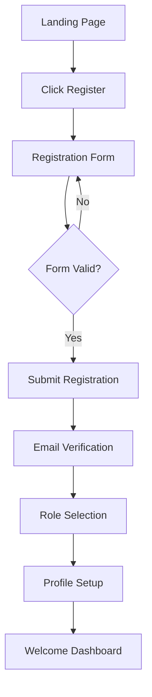

**Steps:**
1. **Landing Page** - User visits ResearchHub homepage
2. **Registration Form** - Fill out basic information
3. **Email Verification** - Confirm email address
4. **Role Selection** - Choose Researcher or Participant
5. **Profile Setup** - Complete profile information
6. **Dashboard Access** - First login to appropriate dashboard

#### Login Flow
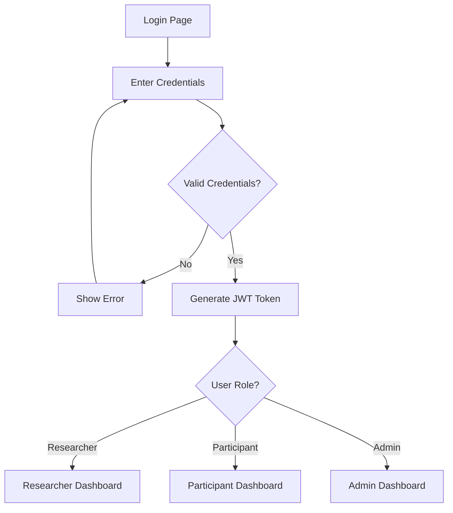

---

### 2. Researcher Workflow

#### Study Creation Flow
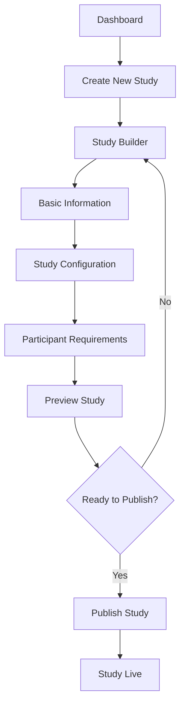

**Detailed Steps:**
1. **Dashboard Access** - Researcher logs into dashboard
2. **Study Creation** - Click "Create New Study" button
3. **Basic Information** - Enter study title, description, objectives
4. **Configuration** - Set study parameters, duration, requirements
5. **Requirements** - Define participant criteria and prerequisites
6. **Preview** - Review study before publishing
7. **Publication** - Make study available to participants

#### Participant Management Flow
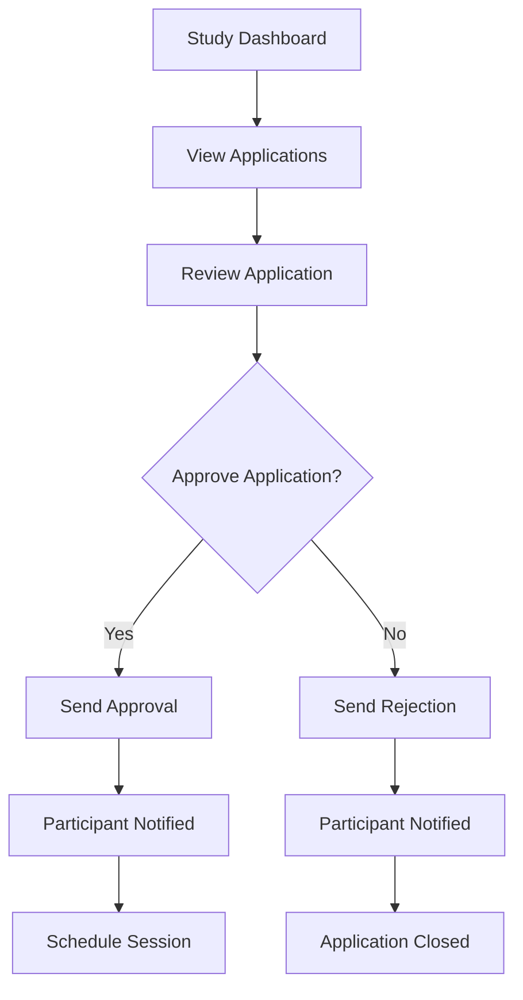

---

### 3. Participant Workflow

#### Study Discovery Flow
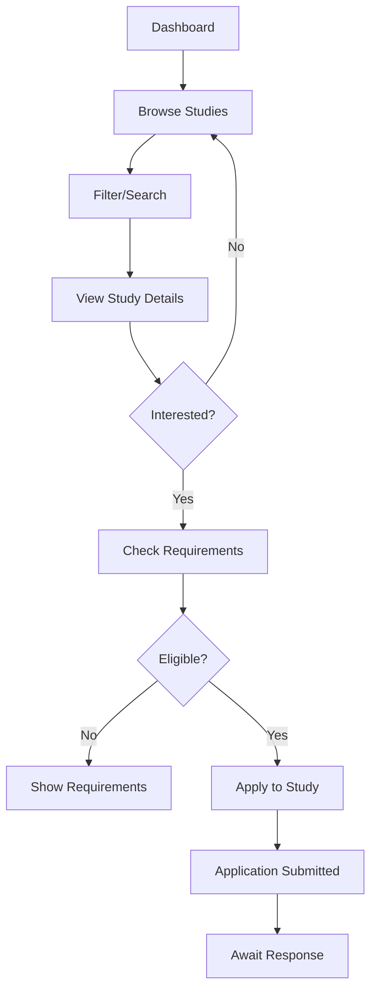

#### Application Process
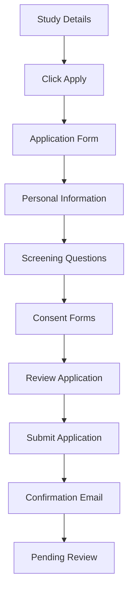

---

### 4. Study Session Flow

#### Session Initiation
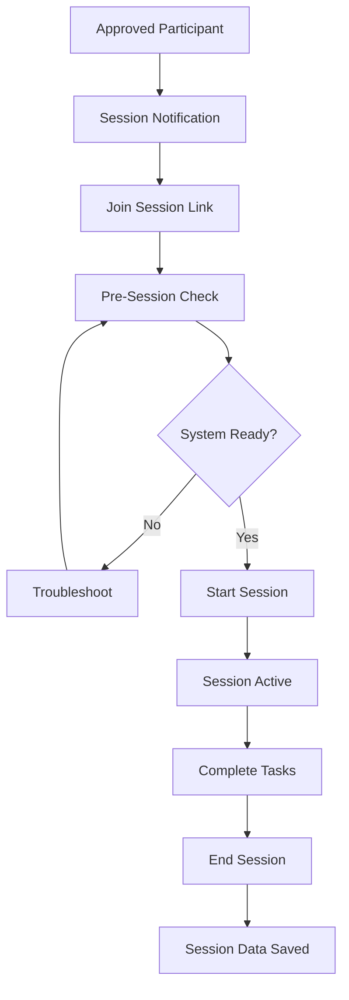

#### Session Monitoring (Researcher View)
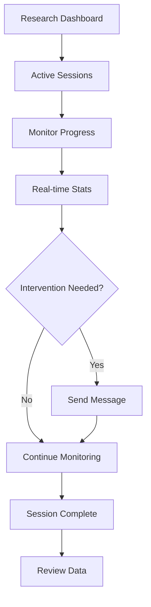

---

### 5. Admin Workflow

#### User Management Flow
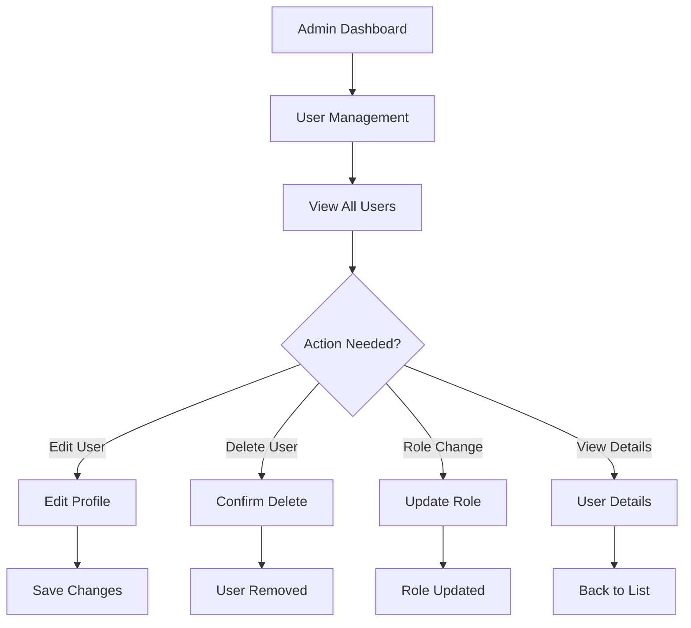

#### System Administration Flow
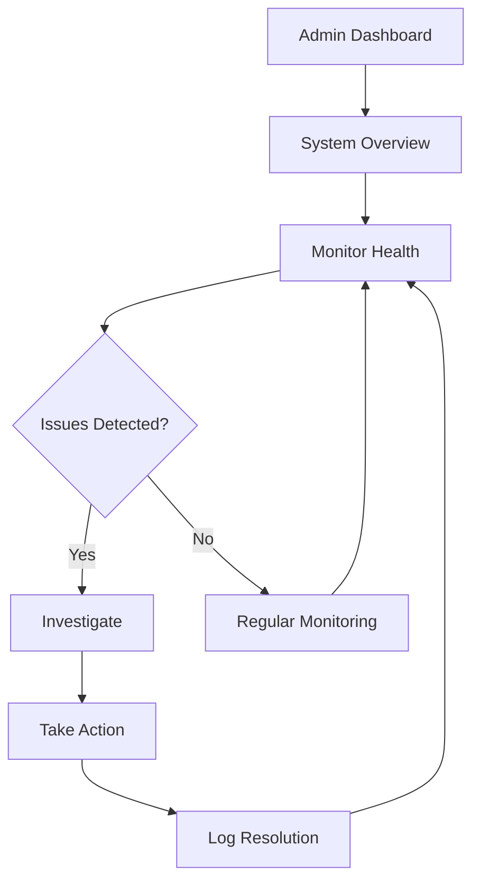

---

## 🔐 Authentication & Security Flows

### JWT Token Management
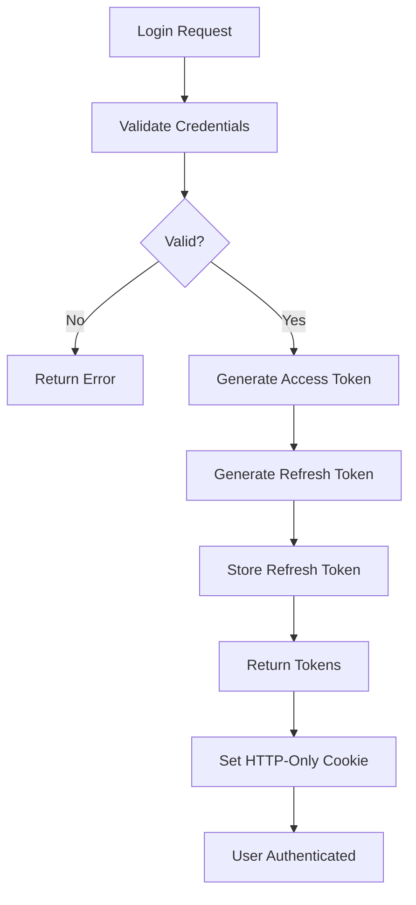

### Token Refresh Flow
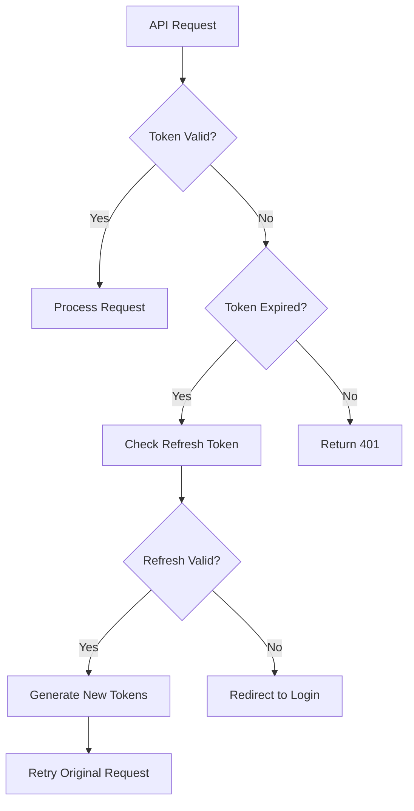

---

## 📱 User Interface Flows

### Navigation Flow
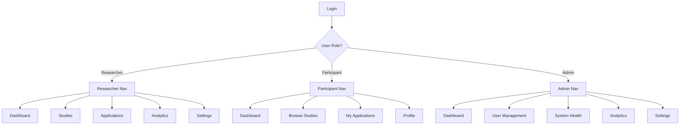

### Page Transition Flow
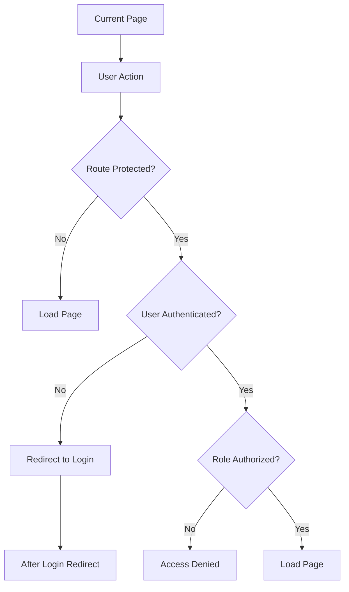

---

## 🔄 Data Flow Architecture

### Study Data Flow
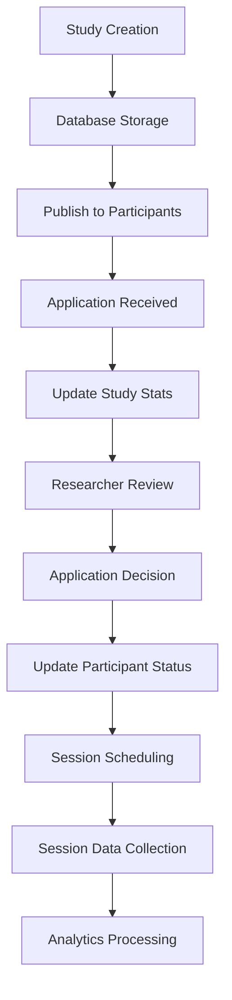

### User Data Flow
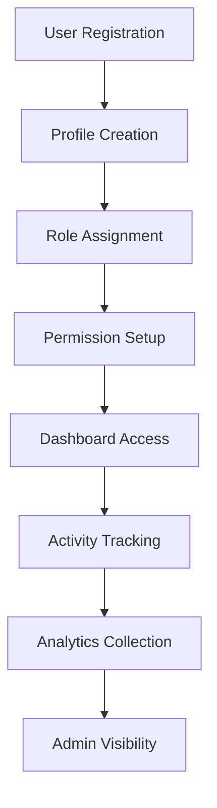

---

## 🚨 Error Handling Flows

### API Error Flow
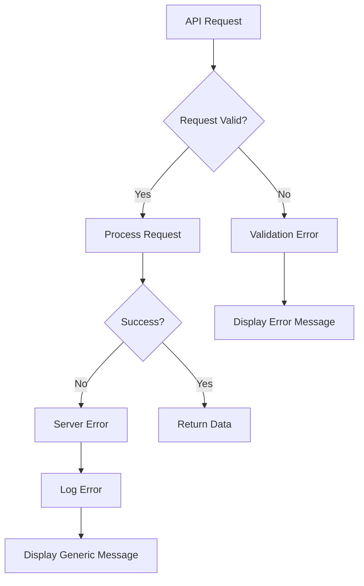

### Form Validation Flow
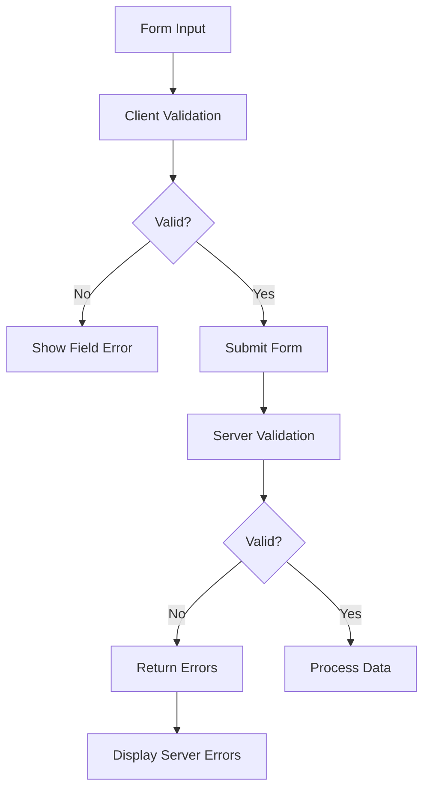

---

## 📊 Analytics & Tracking Flows

### User Behavior Tracking
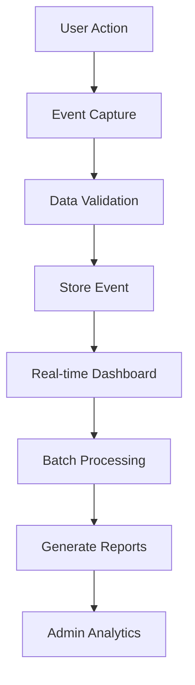

### Study Analytics Flow
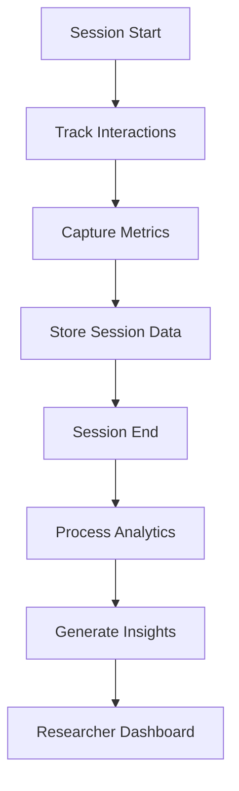

---

## 🔧 Technical Integration Flows

### Database Operations
```mermaid
graph TD
    A[API Request] --> B[Controller]
    B --> C[Validation Middleware]
    C --> D[Service Layer]
    D --> E[Database Model]
    E --> F[MongoDB Operation]
    F --> G[Return Data]
    G --> H[Format Response]
    H --> I[Send to Client]
```

### File Upload Flow
```mermaid
graph TD
    A[File Select] --> B[Client Validation]
    B --> C{Valid File?}
    C -->|No| D[Show Error]
    C -->|Yes| E[Upload to Server]
    E --> F[Server Validation]
    F --> G{Valid?}
    G -->|No| H[Return Error]
    G -->|Yes| I[Process File]
    I --> J[Store Metadata]
    J --> K[Return Success]
```

---

## 📋 Flow Validation Checklist

### User Experience Validation
- [ ] All flows complete successfully end-to-end
- [ ] Error states handled gracefully
- [ ] Loading states provide feedback
- [ ] Success states confirm actions
- [ ] Navigation is intuitive and consistent

### Technical Validation
- [ ] All API endpoints respond correctly
- [ ] Database operations complete successfully
- [ ] Authentication flows secure and functional
- [ ] Authorization properly restricts access
- [ ] Error logging captures important events

### Security Validation
- [ ] Sensitive data properly protected
- [ ] User input validated on client and server
- [ ] Role-based access enforced
- [ ] Session management secure
- [ ] Audit trail maintained for important actions

---

## 📞 Contact & Updates

**Document Owner:** ResearchHub Development Team  
**Last Updated:** June 15, 2025  
**Next Review:** September 15, 2025  

---

*This flow documentation is updated regularly to reflect current application behavior and new feature implementations.*
