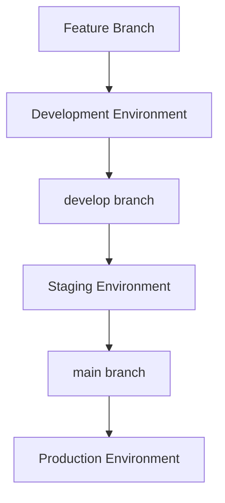

# 🚀 Vercel Multi-Environment Strategy - Best Practice Implementation

## 🎯 **Overview: 3-Environment Architecture**

**Current Problem**: Local works ≠ Production works  
**Solution**: All environments run identically on Vercel  
**Result**: 100% environment parity, zero "works on my machine" issues

## 🏗️ **Environment Architecture**

### **🌍 Production Environment**
- **Branch**: `main`
- **URL**: `https://researchhub.com` (custom domain)
- **Purpose**: Live platform for end users
- **Database**: Production Supabase project
- **Deployment**: Manual approval required

### **🧪 Staging Environment**
- **Branch**: `staging`
- **URL**: `https://staging-researchhub.vercel.app`
- **Purpose**: Final testing before production
- **Database**: Staging Supabase project (copy of production)
- **Deployment**: Auto-deploy on staging branch push

### **⚡ Development Environment**
- **Branch**: `develop` + feature branches
- **URL**: `https://dev-researchhub.vercel.app` + unique URLs per feature
- **Purpose**: Active development and testing
- **Database**: Development Supabase project (test data)
- **Deployment**: Auto-deploy on any branch push

## 🔄 **Branching & Deployment Strategy**



### **Workflow**
1. **Feature Development**: `feature/demo-filtering` → Auto-deploy to unique URL
2. **Integration Testing**: Merge to `develop` → Auto-deploy to staging
3. **Production Release**: Merge to `main` → Deploy to production

## ⚙️ **Environment Configuration**

### **1. Vercel Project Setup**

```bash
# Install Vercel CLI
npm i -g vercel

# Initialize project with environments
vercel --help
vercel env add ENVIRONMENT_NAME production
vercel env add ENVIRONMENT_NAME staging  
vercel env add ENVIRONMENT_NAME development
```

### **2. Environment Variables by Environment**

```bash
# Production Environment
ENVIRONMENT_NAME=production
SUPABASE_URL=https://prod-project.supabase.co
SUPABASE_ANON_KEY=prod_anon_key
SUPABASE_SERVICE_ROLE_KEY=prod_service_key
NEXT_PUBLIC_APP_URL=https://researchhub.com

# Staging Environment
ENVIRONMENT_NAME=staging
SUPABASE_URL=https://staging-project.supabase.co
SUPABASE_ANON_KEY=staging_anon_key
SUPABASE_SERVICE_ROLE_KEY=staging_service_key
NEXT_PUBLIC_APP_URL=https://staging-researchhub.vercel.app

# Development Environment
ENVIRONMENT_NAME=development
SUPABASE_URL=https://dev-project.supabase.co
SUPABASE_ANON_KEY=dev_anon_key
SUPABASE_SERVICE_ROLE_KEY=dev_service_key
NEXT_PUBLIC_APP_URL=https://dev-researchhub.vercel.app
```

### **3. Updated vercel.json Configuration**

```json
{
  "functions": {
    "api/**/*.js": {
      "maxDuration": 10
    }
  },
  "headers": [
    {
      "source": "/api/(.*)",
      "headers": [
        { "key": "Access-Control-Allow-Origin", "value": "*" },
        { "key": "Access-Control-Allow-Methods", "value": "GET, POST, PUT, DELETE, OPTIONS" },
        { "key": "Access-Control-Allow-Headers", "value": "Content-Type, Authorization" }
      ]
    }
  ],
  "github": {
    "autoAlias": true
  },
  "git": {
    "deploymentEnabled": {
      "main": true,
      "staging": true,
      "develop": true
    }
  }
}
```

## 🗄️ **Database Strategy**

### **3 Separate Supabase Projects**

```bash
# 1. Production Database
Project: researchhub-production
URL: https://prod-xyz.supabase.co
Data: Real user data, live studies
Backups: Daily automated backups

# 2. Staging Database  
Project: researchhub-staging
URL: https://staging-xyz.supabase.co
Data: Copy of production (anonymized)
Refresh: Weekly refresh from production

# 3. Development Database
Project: researchhub-development  
URL: https://dev-xyz.supabase.co
Data: Test data, demo studies, development artifacts
Reset: Monthly reset with fresh test data
```

### **Database Schema Sync**

```bash
# Keep schemas in sync across environments
supabase db dump --db-url=$PROD_DB > schema.sql
supabase db reset --db-url=$STAGING_DB
supabase db push schema.sql --db-url=$STAGING_DB
```

## 🔧 **Implementation Steps**

### **Step 1: Setup Branch Structure**

```bash
# Create and configure branches
git checkout main
git checkout -b staging
git push origin staging

git checkout -b develop  
git push origin develop

# Set branch protection rules in GitHub
# main: Require pull request, require status checks
# staging: Require pull request  
# develop: No restrictions
```

### **Step 2: Configure Vercel Environments**

```bash
# Link project to Vercel
vercel link

# Configure environment variables for each environment
vercel env add SUPABASE_URL production
vercel env add SUPABASE_URL staging
vercel env add SUPABASE_URL development

# Repeat for all environment variables
```

### **Step 3: Update Package.json Scripts**

```json
{
  "scripts": {
    "dev": "echo 'Use Vercel environments instead of local'",
    "dev:production": "vercel dev --local-config vercel.json",
    "dev:staging": "vercel dev --local-config vercel.staging.json", 
    "dev:development": "vercel dev --local-config vercel.development.json",
    "deploy:staging": "vercel --target staging",
    "deploy:production": "vercel --prod",
    "test:staging": "npm run test -- --baseURL=https://staging-researchhub.vercel.app",
    "test:production": "npm run test -- --baseURL=https://researchhub.com"
  }
}
```

### **Step 4: Environment Detection in Code**

```javascript
// api/lib/environment.js
export const getEnvironment = () => {
  const env = process.env.ENVIRONMENT_NAME || 'development';
  const isProduction = env === 'production';
  const isStaging = env === 'staging';
  const isDevelopment = env === 'development';
  
  return {
    env,
    isProduction,
    isStaging, 
    isDevelopment,
    databaseUrl: process.env.SUPABASE_URL,
    appUrl: process.env.NEXT_PUBLIC_APP_URL
  };
};

// Usage in API endpoints
import { getEnvironment } from './lib/environment';

export default async function handler(req, res) {
  const { env, isProduction } = getEnvironment();
  
  // Different behavior per environment
  if (isProduction) {
    // Strict error handling
    // Real email notifications
    // Performance monitoring
  } else {
    // Verbose logging
    // Test data allowed
    // Debug information
  }
}
```

## 🚀 **Migration Plan from Current Setup**

### **Phase 1: Setup (Week 1)**
1. Create 3 Supabase projects
2. Configure Vercel environments
3. Setup branch structure
4. Migrate environment variables

### **Phase 2: Testing (Week 2)**  
1. Deploy current code to all environments
2. Test database connections
3. Validate API functionality
4. Compare behavior across environments

### **Phase 3: Workflow (Week 3)**
1. Implement branching workflow
2. Setup automated deployments  
3. Configure monitoring
4. Train team on new process

### **Phase 4: Production (Week 4)**
1. Switch production traffic
2. Decommission local development
3. Monitor and optimize
4. Document lessons learned

## 📊 **Benefits of Multi-Environment Strategy**

### **🎯 Development Benefits**
- **Environment Parity**: Identical behavior across all environments
- **No Local Dependencies**: No need for local Docker, databases, or services
- **Instant Sharing**: Share development URLs with team instantly
- **Real Performance**: Test actual serverless function performance
- **Branch Previews**: Every feature gets its own deployment URL

### **🔒 Quality Benefits**
- **Early Bug Detection**: Catch issues before they reach production
- **Database Testing**: Test migrations in staging before production
- **Performance Validation**: Real-world performance testing
- **Security Testing**: Test authentication in real environment

### **👥 Team Benefits**
- **Collaboration**: Multiple developers can work simultaneously
- **QA Testing**: QA team tests on real staging environment
- **Stakeholder Reviews**: Business stakeholders review staging deployments
- **Customer Demos**: Use staging for customer demonstrations

### **🚀 Operational Benefits**
- **Zero Downtime Deployments**: Blue-green deployment strategy
- **Rollback Capability**: Instant rollback if issues detected
- **Monitoring**: Real monitoring and alerting
- **Compliance**: Meets enterprise deployment standards

## 🔧 **Enhanced Developer Experience**

### **New Development Workflow**

```bash
# 1. Start new feature
git checkout develop
git pull origin develop
git checkout -b feature/demo-filtering

# 2. Develop and test
# Automatic deployment to: https://feature-demo-filtering-researchhub.vercel.app
git add . && git commit -m "feat: demo filtering"
git push origin feature/demo-filtering

# 3. Test and iterate
# Visit deployment URL, test functionality
# Make changes, push again - automatic redeployment

# 4. Merge to staging
git checkout develop
git merge feature/demo-filtering
git push origin develop
# Automatic deployment to: https://staging-researchhub.vercel.app

# 5. Test in staging
# Full integration testing with staging database

# 6. Deploy to production  
git checkout main
git merge develop
git push origin main
# Deployment to: https://researchhub.com
```

### **Testing Commands**

```bash
# Test all environments
npm run test:development
npm run test:staging  
npm run test:production

# Monitor deployments
vercel logs --url=https://staging-researchhub.vercel.app
vercel logs --url=https://researchhub.com
```

## 📋 **Implementation Checklist**

### **✅ Prerequisites**
- [ ] Vercel Pro account (for multiple environments)
- [ ] 3 Supabase projects created
- [ ] GitHub repository with proper branch protection
- [ ] Team access configured

### **✅ Setup Tasks**
- [ ] Configure branch structure (main, staging, develop)
- [ ] Setup environment variables in Vercel
- [ ] Configure database connections
- [ ] Update vercel.json configuration
- [ ] Test deployments to all environments

### **✅ Validation Tasks**
- [ ] API endpoints work in all environments
- [ ] Database connections verified
- [ ] Authentication flows tested
- [ ] Demo data filtering validated
- [ ] Performance acceptable

### **✅ Team Training**
- [ ] Document new workflow
- [ ] Train developers on branching strategy
- [ ] Setup monitoring and alerts
- [ ] Create troubleshooting guide

## 🎯 **Why This Eliminates Local vs Production Issues**

1. **Identical Runtime**: All environments use Vercel serverless functions
2. **Same Dependencies**: Identical package.json and build process
3. **Consistent Database**: All environments use Supabase (not local files)
4. **Real Network**: Test actual API latency and behavior
5. **Environment Variables**: Proper environment-specific configuration
6. **Deployment Pipeline**: Test the actual deployment process

## 🚀 **Next Steps**

1. **Immediate**: Create the 3 Supabase projects
2. **Day 1**: Configure Vercel environments and variables  
3. **Day 2**: Setup branch structure and protection rules
4. **Day 3**: Test deployment pipeline
5. **Day 4**: Migrate current code and validate
6. **Week 2**: Full team migration to new workflow

**Result**: Never again will you have "works locally but not in production" issues! 🎉

---

**Would you like me to start implementing this multi-environment strategy? We can begin with creating the Supabase projects and configuring the Vercel environments.**
