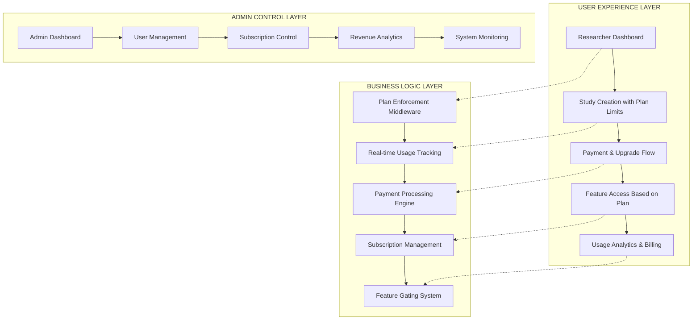
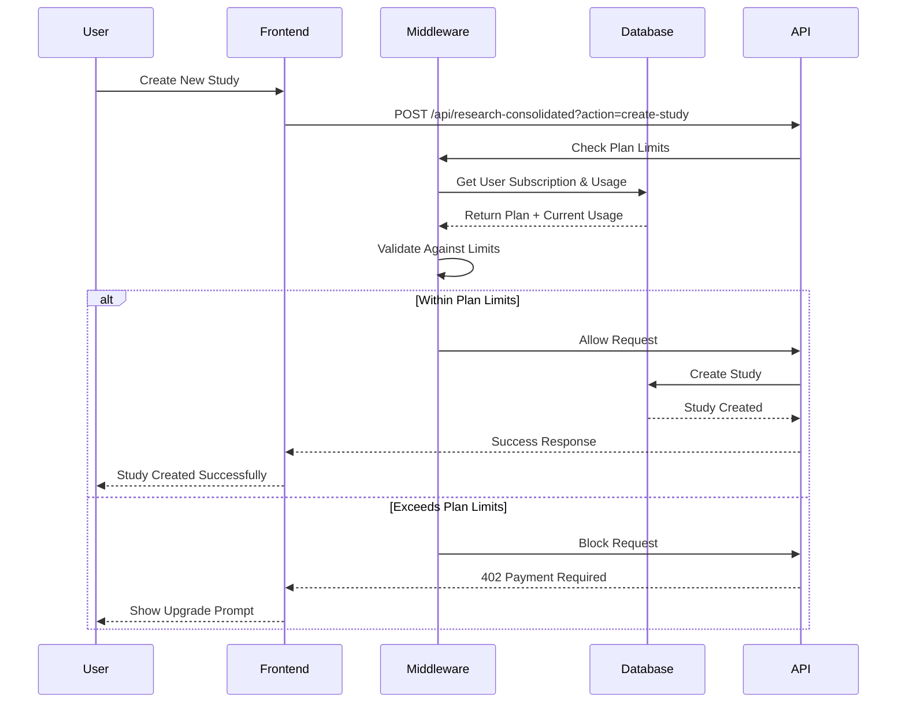
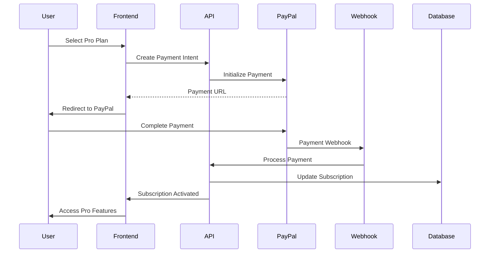
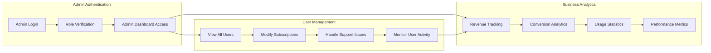
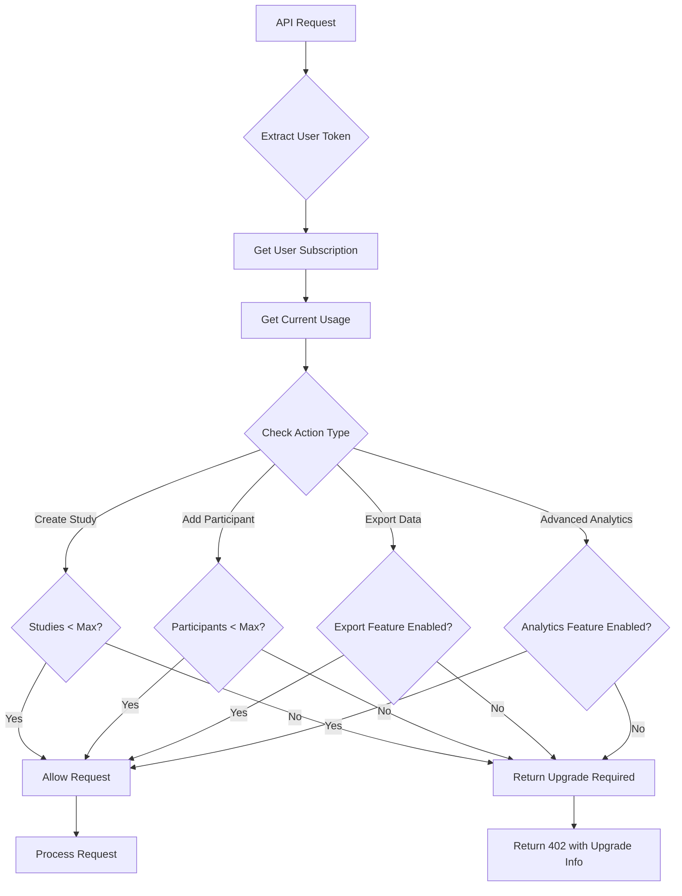
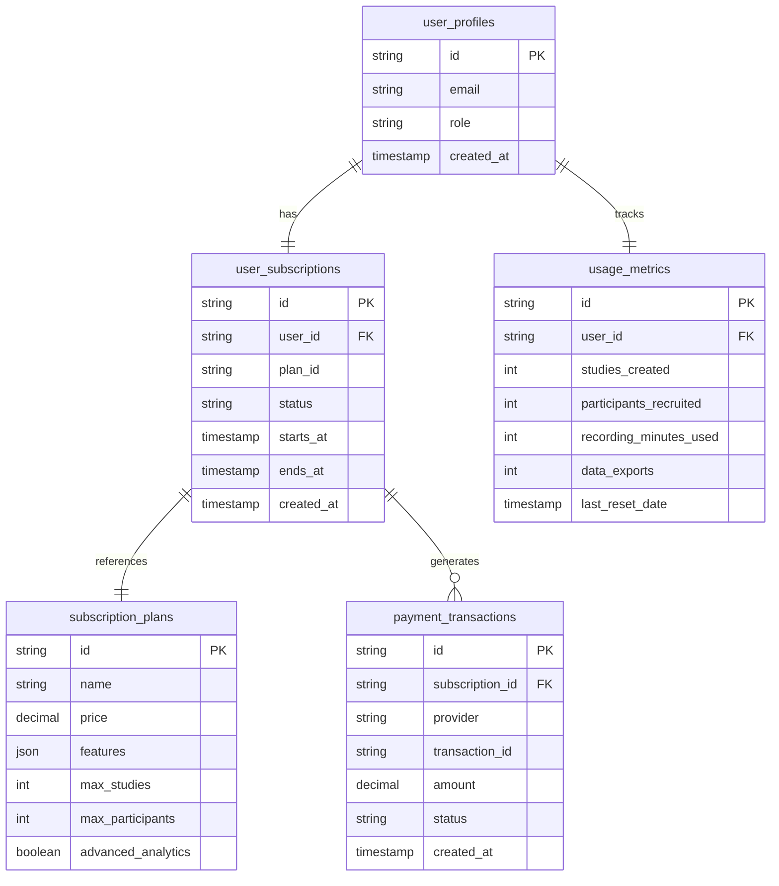
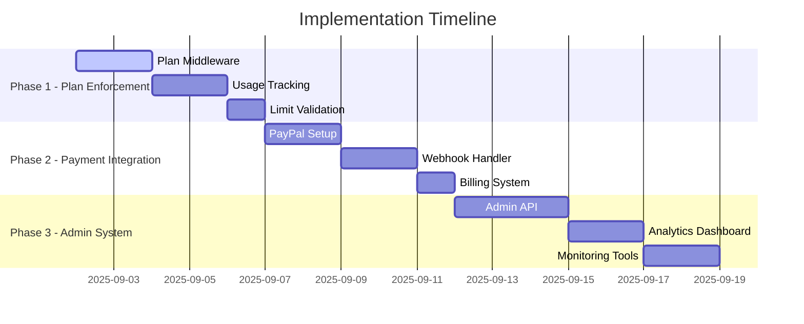
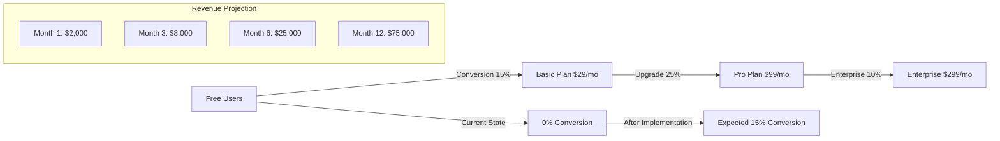

# 🎯 ResearchHub Business Logic Implementation - Visual Architecture Flow

## 📊 Current State vs Target State Architecture

### **CURRENT STATE: UI Excellence, Business Logic Gaps**

```mermaid
graph TD
    subgraph "✅ WORKING EXCELLENT"
        A[User Authentication] --> B[Study Creation UI]
        B --> C[Study Builder with 13 Block Types]
        C --> D[Study Launch Interface]
        D --> E[Study Management Dashboard]
    end
    
    subgraph "⚠️ MISSING BUSINESS LOGIC"
        F[Payment Processing] -.-> G[Mock PayPal Integration]
        H[Plan Enforcement] -.-> I[No Limit Validation]
        J[Admin Operations] -.-> K[Returns Mock Data Only]
        L[Usage Tracking] -.-> M[Not Implemented]
    end
    
    style F fill:#ffcccc
    style H fill:#ffcccc
    style J fill:#ffcccc
    style L fill:#ffcccc
```

### **TARGET STATE: Complete SaaS Platform**

## 🚀 Implementation Flow Diagram

### **Phase 1: Plan Enforcement (Week 1)**

### **Phase 2: Payment Integration (Week 2)**

### **Phase 3: Admin System (Weeks 3-4)**

## 🛠️ Technical Implementation Architecture

### **1. Plan Enforcement Middleware Flow**

### **2. Database Schema Extensions**

## 📈 Success Metrics Dashboard

### **Implementation Progress Tracking**

### **Revenue Impact Projection**

## ✅ Implementation Readiness Checklist

### **Technical Prerequisites**
- [x] Existing subscription types defined in TypeScript
- [x] PayPal integration infrastructure exists
- [x] Supabase database with RLS policies
- [x] User authentication system working
- [x] Admin role system implemented

### **Business Prerequisites**
- [x] Plan pricing structure defined ($29, $99, $299)
- [x] Feature differentiation mapped
- [x] Payment gateway accounts ready
- [x] Legal compliance for billing

### **Development Prerequisites**
- [x] Test accounts available for all roles
- [x] Local development environment working
- [x] Production deployment pipeline ready
- [x] Error handling patterns established

## 🎯 Final Approval Request

This comprehensive action plan provides:

1. **Clear Implementation Phases** - 3 phases over 4 weeks
2. **Technical Architecture** - Detailed middleware and database design
3. **Visual Flow Diagrams** - Current state vs target state mapping
4. **Success Metrics** - Measurable outcomes for each phase
5. **Revenue Projections** - Expected business impact

**Ready for Implementation**: All prerequisites met, architecture planned, and success criteria defined.

**Next Step**: Please approve this plan so we can begin Phase 1 implementation with plan enforcement and usage tracking systems.

---

**Implementation Start**: Upon approval, beginning with plan enforcement middleware development in local environment, followed by production deployment and validation.
