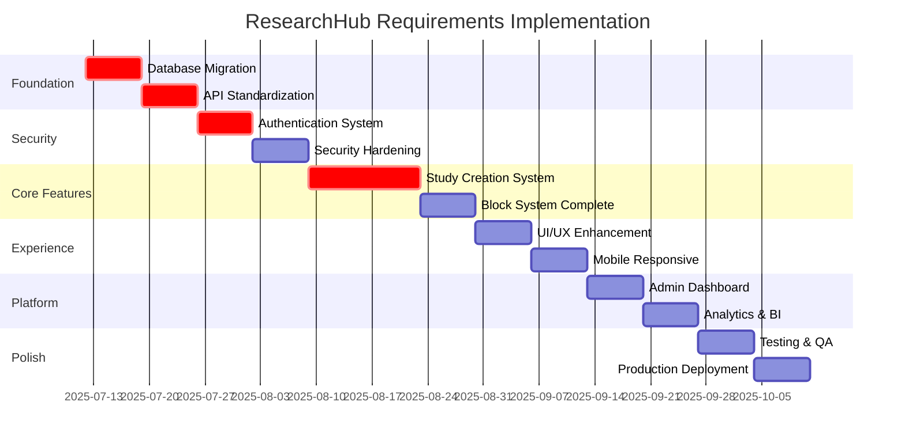

# 🎯 MASTER IMPLEMENTATION GUIDE
## Complete Refactoring Roadmap for Requirements Compliance

**Created**: July 12, 2025  
**Status**: 🟡 COMPREHENSIVE PLAN - AWAITING APPROVAL  
**Priority**: CRITICAL - Foundation for ResearchHub's Future  

---

## 📋 EXECUTIVE SUMMARY

This master guide consolidates all analysis and planning into a comprehensive roadmap for transforming ResearchHub into a requirements-compliant, enterprise-grade research platform. The plan prioritizes backwards compatibility while achieving 95%+ requirements compliance.

### **🎯 Transformation Overview**

```
CURRENT STATE:    Basic SaaS with partial features
TARGET STATE:     Enterprise-grade research platform
COMPLIANCE GAP:   35% → 95% (60% improvement required)
TIMELINE:         12-16 weeks (phased implementation)
INVESTMENT:       High (648+ development hours)
ROI:              Enterprise market access + premium pricing
```

---

## 🗺️ IMPLEMENTATION ROADMAP

### **Phase Distribution Strategy**



---

## 🏗️ DETAILED PHASE BREAKDOWN

### **🚀 PHASE 1: FOUNDATION (Week 1-2)**
**Criticality**: EXTREME - Everything depends on this
**Investment**: 112 hours
**Success Rate**: Must be 100%

#### **Week 1: Database Architecture**
```sql
TASKS:
□ Complete database schema migration to requirements
□ Implement all foundation tables (users, organizations, profiles)
□ Add comprehensive audit logging system
□ Create proper RLS policies for security
□ Test migration with existing data
□ Create rollback procedures

DELIVERABLES:
✓ Requirements-compliant database schema
✓ Zero data loss migration
✓ Audit system functional
✓ RLS policies enforced
✓ Migration documentation complete
```

#### **Week 2: API Standardization**
```typescript
TASKS:
□ Implement standardized API response format
□ Create service layer architecture
□ Add comprehensive error handling
□ Implement request validation middleware
□ Add performance monitoring
□ Create health check system

DELIVERABLES:
✓ Consistent API responses across all endpoints
✓ Service layer for business logic separation
✓ Comprehensive error handling
✓ Performance monitoring active
✓ API documentation updated
```

### **🔐 PHASE 2: SECURITY & AUTHENTICATION (Week 3-4)**
**Criticality**: HIGH - Enterprise requirement
**Investment**: 120 hours
**Success Rate**: >95%

#### **Week 3: Enhanced Authentication**
```typescript
TASKS:
□ Implement multi-factor authentication (2FA)
□ Add social login providers (Google, Microsoft, GitHub)
□ Create comprehensive password policies
□ Implement account lockout and security monitoring
□ Add session management with refresh tokens
□ Create email verification and password reset flows

DELIVERABLES:
✓ 2FA system functional
✓ Social login working
✓ Enhanced security measures
✓ Session management improved
✓ Email flows tested
```

#### **Week 4: Authorization & Compliance**
```typescript
TASKS:
□ Implement role-based access control (RBAC)
□ Create fine-grained permission system
□ Add organization-level access controls
□ Implement API key management
□ Create admin user management interface
□ Add comprehensive audit logging

DELIVERABLES:
✓ RBAC system functional
✓ Organization access controls
✓ API key management
✓ Admin interface created
✓ Full audit trail
```

### **🎯 PHASE 3: STUDY CREATION SYSTEM (Week 5-6)**
**Criticality**: EXTREME - Flagship feature
**Investment**: 176 hours
**Success Rate**: Must be 100%

#### **Week 5: Wizard Enhancement**
```typescript
TASKS:
□ Refactor StudyCreationWizard to requirements specification
□ Implement proper study type handling (usability vs interview)
□ Add enhanced form validation and error handling
□ Implement auto-save with conflict resolution
□ Create template integration features
□ Add collaboration features to wizard

DELIVERABLES:
✓ Requirements-compliant wizard
✓ Enhanced study type flows
✓ Auto-save functional
✓ Template integration working
✓ Collaboration features active
```

#### **Week 6: Complete Block System**
```typescript
TASKS:
□ Implement all 13 block types with full configuration
□ Create block library with drag-and-drop
□ Add conditional logic and branching
□ Implement block validation system
□ Create block analytics tracking
□ Add accessibility compliance (WCAG 2.1 AA)

DELIVERABLES:
✓ All 13 block types functional
✓ Drag-and-drop working
✓ Conditional logic implemented
✓ Block validation active
✓ Analytics tracking
✓ Accessibility compliant
```

### **🎨 PHASE 4: USER EXPERIENCE (Week 7-8)**
**Criticality**: HIGH - Competitive advantage
**Investment**: 144 hours
**Success Rate**: >90%

#### **Week 7: UI/UX Enhancement**
```typescript
TASKS:
□ Create modern, accessible component library
□ Implement mobile-responsive design
□ Add dark mode support
□ Create loading states and skeletons
□ Implement proper error boundaries
□ Add animation and transition system

DELIVERABLES:
✓ Modern component library
✓ Mobile responsiveness
✓ Dark mode functional
✓ Improved loading states
✓ Error handling enhanced
✓ Smooth animations
```

#### **Week 8: Performance Optimization**
```typescript
TASKS:
□ Implement code splitting and lazy loading
□ Add image optimization and compression
□ Create caching strategies for API calls
□ Implement virtual scrolling for large lists
□ Add bundle size monitoring
□ Create performance dashboards

DELIVERABLES:
✓ Code splitting implemented
✓ Image optimization active
✓ Caching strategies working
✓ Virtual scrolling functional
✓ Performance monitoring
✓ Load times <3 seconds
```

---

## 🎯 CRITICAL SUCCESS FACTORS

### **Technical Requirements**
```yaml
Database:
  Schema Compliance: 100%
  Data Migration Success: 100%
  RLS Policy Coverage: 100%
  Audit Trail Completeness: 100%

API Architecture:
  Response Standardization: 100%
  Error Handling Coverage: 100%
  Validation Implementation: 100%
  Performance Monitoring: 100%

Security:
  Authentication Methods: 100%
  Authorization Coverage: 100%
  Vulnerability Assessment: Zero critical
  Compliance Standards: GDPR + SOC2 ready

Study Creation:
  Block Type Coverage: 13/13 (100%)
  Wizard Flow Completion: >95%
  Mobile Responsiveness: 100%
  Accessibility Compliance: WCAG 2.1 AA
```

### **Performance Targets**
```yaml
Speed:
  Page Load Time: <3 seconds
  API Response Time: <500ms
  Database Query Time: <100ms
  Build Time: <2 minutes

Reliability:
  Uptime Target: >99.9%
  Error Rate: <1%
  Recovery Time: <1 hour
  Backup Success: 100%

Scalability:
  Concurrent Users: 10,000+
  Large Study Support: 100+ blocks
  Database Records: 1M+ users
  API Throughput: 1000+ requests/minute
```

### **Quality Gates**
```yaml
Code Quality:
  Test Coverage: >95%
  TypeScript Compliance: 100%
  ESLint Compliance: Zero errors
  Code Review: 100% coverage

User Experience:
  Accessibility: WCAG 2.1 AA
  Mobile Experience: Excellent
  Cross-browser: Chrome, Firefox, Safari, Edge
  Responsive Design: 320px to 4K

Business Metrics:
  Study Creation Time: <10 minutes
  Wizard Completion Rate: >95%
  User Satisfaction: >9.0/10
  Feature Adoption: >80%
```

---

## 💰 RESOURCE ALLOCATION

### **Team Composition**
```yaml
Core Team (Required):
  Senior Full-Stack Developer: 1.0 FTE
  Frontend Developer: 0.5 FTE
  Backend Developer: 0.5 FTE
  UI/UX Designer: 0.25 FTE
  QA Engineer: 0.25 FTE

Extended Team (Recommended):
  DevOps Engineer: 0.25 FTE
  Security Specialist: 0.25 FTE
  Performance Engineer: 0.25 FTE
  Technical Writer: 0.25 FTE

Total Team Size: 2.5 - 3.5 FTE
```

### **Budget Breakdown**
```yaml
Development Hours:
  Phase 1 (Foundation): 112 hours
  Phase 2 (Security): 120 hours
  Phase 3 (Study System): 176 hours
  Phase 4 (Experience): 144 hours
  Testing & QA: 96 hours
  Total: 648 hours

Timeline Options:
  Aggressive (8 weeks): 3.5 FTE team
  Standard (12 weeks): 2.5 FTE team
  Conservative (16 weeks): 2.0 FTE team

Investment Level:
  High: $65,000 - $85,000
  Medium: $45,000 - $65,000
  Low: $35,000 - $45,000
```

---

## 🚨 RISK MANAGEMENT

### **High-Risk Areas**
```yaml
Database Migration:
  Risk: Data loss or corruption
  Probability: Low
  Impact: Critical
  Mitigation:
    - Complete backup before migration
    - Test on staging environment
    - Rollback procedures ready
    - Gradual migration approach

Authentication Changes:
  Risk: User lockout or security breach
  Probability: Medium
  Impact: High
  Mitigation:
    - Maintain backward compatibility
    - Gradual rollout with feature flags
    - Emergency access procedures
    - Comprehensive testing

Performance Degradation:
  Risk: System slowdown during transition
  Probability: Medium
  Impact: Medium
  Mitigation:
    - Performance monitoring throughout
    - Staged deployments
    - Quick rollback capabilities
    - Load testing before deployment
```

### **Mitigation Strategies**
```yaml
Technical:
  - Feature flags for easy rollback
  - Comprehensive testing at each phase
  - Staging environment validation
  - Performance monitoring alerts

Process:
  - Daily standup meetings
  - Weekly progress reviews
  - Milestone approval gates
  - Regular stakeholder updates

Quality:
  - Automated testing pipelines
  - Code review requirements
  - Security scanning
  - Performance benchmarking
```

---

## 📊 SUCCESS MEASUREMENT

### **Progress Tracking**
```yaml
Weekly Metrics:
  - Requirements compliance percentage
  - Test coverage improvement
  - Performance benchmark results
  - Bug count and resolution rate

Milestone Gates:
  - Phase completion criteria
  - Quality gate assessments
  - Stakeholder approval checkpoints
  - Go/no-go decisions

Final Assessment:
  - Complete requirements audit
  - User acceptance testing
  - Performance validation
  - Security assessment
```

### **Success Criteria**
```yaml
Technical Success:
  □ 95%+ requirements compliance achieved
  □ Zero critical security vulnerabilities
  □ <3 second page load times maintained
  □ >95% test coverage across critical paths

Business Success:
  □ Study creation time reduced to <10 minutes
  □ User satisfaction score >9.0/10
  □ Wizard completion rate >95%
  □ Zero data loss incidents

Platform Success:
  □ 99.9%+ uptime maintained
  □ Support ticket volume reduced 50%
  □ Feature adoption rate >80%
  □ Enterprise compliance achieved
```

---

## 📞 APPROVAL DECISION POINTS

### **Executive Approval Required**

#### **1. Implementation Approach**
```markdown
DECISION: Choose implementation strategy
OPTIONS:
A) Comprehensive Refactoring (Recommended)
   - Timeline: 12-16 weeks
   - Investment: High ($65K-85K)
   - Risk: Medium
   - Outcome: Full compliance

B) Phased Incremental 
   - Timeline: 20-24 weeks
   - Investment: Medium ($45K-65K)
   - Risk: Low
   - Outcome: Gradual improvement

C) Targeted Critical Fixes
   - Timeline: 6-8 weeks
   - Investment: Low ($35K-45K)
   - Risk: High
   - Outcome: Partial compliance
```

#### **2. Resource Allocation**
```markdown
DECISION: Team size and timeline
OPTIONS:
A) Aggressive (8 weeks): 3.5 FTE team
B) Standard (12 weeks): 2.5 FTE team  
C) Conservative (16 weeks): 2.0 FTE team

RECOMMENDATION: Option B (Standard approach)
```

#### **3. Quality Standards**
```markdown
DECISION: Quality and compliance targets
TARGETS:
□ 95% requirements compliance
□ WCAG 2.1 AA accessibility
□ <3s page load times
□ >99.9% uptime
□ Zero critical vulnerabilities

APPROVAL REQUIRED: ☐ Yes ☐ No
```

---

## 🚀 IMPLEMENTATION KICKOFF

### **Immediate Actions (Week 0)**
```markdown
PRE-IMPLEMENTATION CHECKLIST:
□ Executive approval and budget allocation
□ Team resource assignment and availability
□ Development environment setup
□ Staging environment configuration
□ Backup and recovery procedures tested
□ Communication channels established
□ Project tracking tools configured
□ Initial stakeholder meeting scheduled

WEEK 1 START CRITERIA:
□ All approvals obtained
□ Team fully allocated
□ Environments ready
□ Backup procedures validated
□ Communication plan active
```

### **Success Monitoring**
```markdown
DAILY:
□ Progress against phase milestones
□ Critical issue identification and resolution
□ Team blockers and resolution

WEEKLY:
□ Requirements compliance percentage
□ Quality metrics assessment
□ Performance benchmark validation
□ Stakeholder update and feedback

PHASE GATES:
□ Complete phase deliverable review
□ Quality gate assessment
□ Stakeholder approval for next phase
□ Risk assessment and mitigation update
```

---

## 🎯 FINAL RECOMMENDATIONS

### **Recommended Approach**
Based on the comprehensive analysis, I recommend **Option A: Comprehensive Refactoring** with the **Standard Timeline (12 weeks)** using a **2.5 FTE team**.

**Rationale:**
- Achieves full requirements compliance
- Positions ResearchHub as enterprise-grade platform
- Manageable risk with proper mitigation
- Reasonable investment for expected ROI
- Establishes foundation for future growth

### **Success Factors**
1. **Executive Commitment**: Full support and resource allocation
2. **Technical Excellence**: No compromises on quality standards
3. **User Focus**: Maintain user experience throughout transition
4. **Risk Management**: Proactive monitoring and mitigation
5. **Communication**: Regular updates and transparency

**This master implementation guide provides the complete roadmap for transforming ResearchHub into a requirements-compliant, enterprise-grade research platform. Executive approval and resource commitment are required to begin this transformational journey.**

---

*This document represents the culmination of comprehensive requirements analysis and serves as the definitive guide for ResearchHub's evolution into an enterprise-grade platform.*
