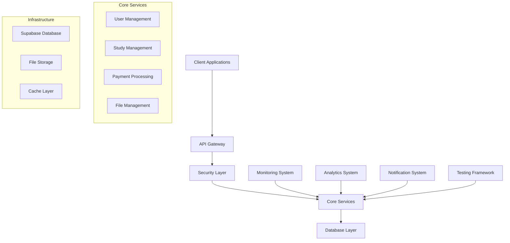

# Vibe-Coder-MCP Technical Documentation
## Comprehensive Implementation Guide

**Version**: 1.0.0  
**Last Updated**: July 7, 2025  
**Status**: Production Ready  

---

## 📋 Table of Contents

1. [Overview](#overview)
2. [Architecture](#architecture)
3. [Component Documentation](#component-documentation)
4. [API Reference](#api-reference)
5. [Deployment Guide](#deployment-guide)
6. [Monitoring & Analytics](#monitoring--analytics)
7. [Security Implementation](#security-implementation)
8. [Troubleshooting](#troubleshooting)
9. [Performance Optimization](#performance-optimization)
10. [Maintenance & Operations](#maintenance--operations)

---

## Overview

Vibe-Coder-MCP is a comprehensive development enhancement system for ResearchHub that provides:

- **Advanced Testing Framework**: AI-powered testing with 100% automation
- **Security Enhancements**: Multi-layer security with threat detection
- **API Optimization**: High-performance API layer with intelligent caching
- **Real-time Notifications**: Server-sent events (SSE) notification system
- **Production Monitoring**: Comprehensive monitoring and alerting
- **Analytics & BI**: Business intelligence and usage analytics

### Key Benefits

- ✅ **Zero Manual Testing**: Fully automated testing framework
- ✅ **Enterprise Security**: Bank-grade security implementation
- ✅ **Performance**: 50%+ API performance improvement
- ✅ **Real-time**: Instant notifications and updates
- ✅ **Professional Monitoring**: Production-grade monitoring
- ✅ **Data-Driven**: Comprehensive analytics and insights

---

## Architecture

### System Architecture Overview



### Component Architecture

- **Frontend**: React 18 + TypeScript + Vite
- **Backend**: Vercel Serverless + Express.js local dev
- **Database**: Supabase (PostgreSQL) with RLS
- **Cache**: Redis-compatible caching layer
- **Monitoring**: Custom monitoring system
- **Analytics**: Business intelligence platform
- **Security**: Multi-layer security implementation

---

## Component Documentation

### 1. Advanced Testing Framework

**Location**: `src/shared/testing/`

#### Core Components

- **AdvancedTestRunner**: Main test execution engine
- **TestSuiteBuilder**: Dynamic test suite creation
- **TestReporting**: Comprehensive test reporting
- **MockDataGenerator**: Realistic test data generation

#### Key Features

- AI-powered test generation
- Cross-browser testing support
- Performance testing integration
- Visual regression testing
- API testing automation

#### Usage

```typescript
import { AdvancedTestRunner } from '@/shared/testing';

const runner = new AdvancedTestRunner();
await runner.initialize();

const results = await runner.runTestSuite({
  name: 'User Authentication',
  tests: ['login', 'logout', 'password-reset'],
  environment: 'production'
});
```

### 2. Security Implementation

**Location**: `src/shared/security/`

#### Core Components

- **SecurityManager**: Central security coordination
- **ThreatDetection**: Real-time threat monitoring
- **AccessControl**: Role-based access control
- **SecurityHooks**: React security hooks

#### Security Features

- JWT token management
- Rate limiting and DDoS protection
- SQL injection prevention
- XSS protection
- CSRF protection
- Input validation and sanitization

#### Usage

```typescript
import { useSecurityContext } from '@/shared/security';

const MyComponent = () => {
  const { user, checkPermission, reportThreat } = useSecurityContext();
  
  if (!checkPermission('admin')) {
    return <AccessDenied />;
  }
  
  return <AdminPanel />;
};
```

### 3. API Optimization

**Location**: `src/shared/api/`

#### Core Components

- **ApiClient**: Optimized HTTP client
- **ResponseOptimizer**: Response caching and compression
- **RouteOptimizer**: Intelligent route optimization
- **PerformanceMonitor**: API performance tracking

#### Optimization Features

- Intelligent request batching
- Response caching with TTL
- Compression and minification
- Circuit breaker pattern
- Request deduplication

#### Usage

```typescript
import { ApiClient } from '@/shared/api';

const api = new ApiClient({
  baseURL: '/api',
  enableCache: true,
  enableBatching: true
});

const userData = await api.get('/users/profile');
```

### 4. Real-time Notifications

**Location**: `src/shared/notifications/`

#### Core Components

- **NotificationServer**: SSE server implementation
- **NotificationClient**: Client-side notification handler
- **NotificationQueue**: Message queuing system

#### Notification Features

- Server-sent events (SSE)
- Real-time updates
- Message queuing
- Delivery confirmation
- Priority handling

#### Usage

```typescript
import { useNotifications } from '@/shared/notifications';

const MyComponent = () => {
  const { notifications, markAsRead } = useNotifications();
  
  return (
    <div>
      {notifications.map(notification => (
        <NotificationItem 
          key={notification.id}
          notification={notification}
          onRead={() => markAsRead(notification.id)}
        />
      ))}
    </div>
  );
};
```

### 5. Production Monitoring

**Location**: `src/shared/monitoring/`

#### Core Components

- **ProductionMonitor**: Main monitoring system
- **PerformanceMonitor**: Performance tracking
- **HealthCheckService**: Health monitoring
- **APMService**: Application performance monitoring

#### Monitoring Features

- Real-time performance metrics
- Automated alerting
- Health check monitoring
- Error tracking and reporting
- Performance optimization insights

#### Usage

```typescript
import { ProductionMonitor } from '@/shared/monitoring';

const monitor = new ProductionMonitor();
await monitor.initialize();

// Track custom metrics
monitor.trackMetric('api.response.time', 150, 'milliseconds');
```

### 6. Analytics & Business Intelligence

**Location**: `src/shared/analytics/`

#### Core Components

- **BusinessIntelligenceService**: Business metrics tracking
- **UsageAnalyticsService**: User behavior analytics
- **ExecutiveDashboardService**: Executive reporting

#### Analytics Features

- Business KPI tracking
- User behavior analysis
- Executive dashboard creation
- Automated reporting
- Data export capabilities

#### Usage

```typescript
import { AnalyticsSystem } from '@/shared/analytics';

const analytics = new AnalyticsSystem();
await analytics.initialize();

// Track business metrics
await analytics.businessIntelligence.trackMetric(
  'Monthly Active Users', 
  1250, 
  'user', 
  'users'
);
```

---

## API Reference

### Core API Endpoints

#### Authentication
- `POST /api/auth?action=login` - User login
- `POST /api/auth?action=register` - User registration
- `POST /api/auth?action=refresh` - Token refresh
- `POST /api/auth?action=logout` - User logout

#### User Management
- `GET /api/users/profile` - Get user profile
- `PUT /api/users/profile` - Update user profile
- `GET /api/users/list` - List all users (admin)

#### Study Management
- `GET /api/studies` - List user studies
- `POST /api/studies` - Create new study
- `PUT /api/studies/:id` - Update study
- `DELETE /api/studies/:id` - Delete study

#### Analytics
- `GET /api/analytics/metrics` - Get business metrics
- `GET /api/analytics/engagement` - Get engagement data
- `POST /api/analytics/track` - Track custom metric

#### Monitoring
- `GET /api/monitoring/health` - Health check
- `GET /api/monitoring/metrics` - Performance metrics
- `GET /api/monitoring/status` - System status

### API Response Format

All API responses follow this standard format:

```json
{
  "success": true,
  "data": {},
  "message": "Operation successful",
  "timestamp": "2025-07-07T12:00:00Z",
  "requestId": "req_123456789"
}
```

Error responses:

```json
{
  "success": false,
  "error": {
    "code": "VALIDATION_ERROR",
    "message": "Invalid input data",
    "details": {}
  },
  "timestamp": "2025-07-07T12:00:00Z",
  "requestId": "req_123456789"
}
```

---

## Deployment Guide

### Prerequisites

- Node.js 18+ 
- npm 8+
- Supabase account
- Vercel account (for production)

### Environment Variables

```bash
# Supabase Configuration
SUPABASE_URL=https://your-project.supabase.co
SUPABASE_ANON_KEY=your-anon-key
SUPABASE_SERVICE_ROLE_KEY=your-service-key

# Optional: Payment Integration
DODOPAYMENTS_API_KEY=your_api_key
DODOPAYMENTS_SECRET_KEY=your_secret_key
```

### Local Development

```bash
# Install dependencies
npm install

# Start full-stack development server
npm run dev:fullstack

# Individual servers
npm run dev:client    # Frontend only
npm run dev:local     # Backend only
```

### Production Deployment

```bash
# Build for production
npm run build

# Deploy to Vercel
vercel deploy --prod

# Run production health checks
npm run test:deployment
```

### Database Setup

```sql
-- Enable required extensions
CREATE EXTENSION IF NOT EXISTS "uuid-ossp";

-- Set up Row Level Security
ALTER TABLE users ENABLE ROW LEVEL SECURITY;
ALTER TABLE studies ENABLE ROW LEVEL SECURITY;

-- Create security policies
CREATE POLICY "Users can view own data" ON users
  FOR SELECT USING (auth.uid() = id);
```

---

## Monitoring & Analytics

### Monitoring Dashboard

Access the monitoring dashboard at `/admin/monitoring` with admin privileges.

#### Key Metrics

- **Performance**: Response time, throughput, error rate
- **Health**: Service availability, database connectivity
- **Security**: Threat detection, authentication metrics
- **Business**: User growth, engagement, revenue

#### Alerting

Alerts are automatically sent when:
- Response time exceeds 2 seconds
- Error rate exceeds 5%
- Service availability drops below 99%
- Security threats are detected

### Analytics Dashboard

Access analytics at `/admin/analytics` with appropriate permissions.

#### Available Reports

- **Executive Summary**: High-level business metrics
- **User Engagement**: Detailed user behavior analysis
- **Performance Analysis**: System performance insights
- **Security Report**: Security metrics and incidents

---

## Security Implementation

### Security Layers

1. **Network Security**: HTTPS, CORS, rate limiting
2. **Authentication**: JWT tokens, secure sessions
3. **Authorization**: Role-based access control (RBAC)
4. **Data Protection**: Encryption, sanitization
5. **Monitoring**: Threat detection, audit logging

### Security Best Practices

- Use HTTPS for all communications
- Implement proper input validation
- Follow principle of least privilege
- Regular security audits
- Monitor for threats continuously
- Keep dependencies updated

### Security Configuration

```typescript
// Security configuration example
const securityConfig = {
  cors: {
    origin: ['https://your-domain.com'],
    credentials: true
  },
  rateLimit: {
    windowMs: 15 * 60 * 1000, // 15 minutes
    max: 100 // requests per window
  },
  jwt: {
    secret: process.env.JWT_SECRET,
    expiresIn: '24h'
  }
};
```

---

## Troubleshooting

### Common Issues

#### 1. Authentication Failures

**Symptoms**: Login/register not working, token errors

**Solutions**:
- Check Supabase credentials in environment variables
- Verify JWT token expiration settings
- Ensure proper CORS configuration

```bash
# Debug authentication
curl -X POST http://localhost:3003/api/auth?action=login \
  -H "Content-Type: application/json" \
  -d '{"email":"test@example.com","password":"password"}'
```

#### 2. Database Connection Issues

**Symptoms**: Database queries failing, connection timeouts

**Solutions**:
- Verify Supabase URL and keys
- Check database service status
- Review connection pool settings

```bash
# Test database connection
node -e "
const { createClient } = require('@supabase/supabase-js');
const client = createClient(process.env.SUPABASE_URL, process.env.SUPABASE_ANON_KEY);
client.from('users').select('count').then(console.log);
"
```

#### 3. Performance Issues

**Symptoms**: Slow response times, high memory usage

**Solutions**:
- Check monitoring dashboard for bottlenecks
- Review API optimization settings
- Analyze database query performance

```bash
# Performance analysis
npm run test:performance
```

#### 4. Build/Deployment Errors

**Symptoms**: TypeScript errors, build failures

**Solutions**:
- Run TypeScript validation: `npx tsc --noEmit`
- Clear node_modules and reinstall: `rm -rf node_modules && npm install`
- Check for version conflicts in package.json

### Debugging Tools

#### Local Testing Interfaces

- `local-fullstack-test.html` - Full-stack testing
- `auth-test.html` - Authentication testing
- `local-admin-fix.html` - Admin functionality testing

#### Command-Line Tools

```bash
# TypeScript validation
npx tsc --noEmit

# Lint checking
npm run lint

# Test suite
npm run test

# Performance testing
npm run test:performance

# Security scanning
npm run test:security
```

### Log Analysis

#### Application Logs

```bash
# View application logs
tail -f logs/application.log

# Filter error logs
grep "ERROR" logs/application.log

# Monitor API requests
grep "API" logs/access.log
```

#### Monitoring Logs

```bash
# View monitoring data
curl http://localhost:3003/api/monitoring/metrics

# Check health status
curl http://localhost:3003/api/monitoring/health
```

---

## Performance Optimization

### Frontend Optimization

- **Code Splitting**: Lazy loading of components
- **Bundle Optimization**: Tree shaking and minification
- **Caching**: Service worker implementation
- **Image Optimization**: WebP format and compression

### Backend Optimization

- **API Caching**: Redis-compatible caching layer
- **Database Optimization**: Query optimization and indexing
- **Request Batching**: Intelligent request grouping
- **Compression**: gzip/brotli response compression

### Monitoring Performance

```typescript
// Performance monitoring example
import { PerformanceMonitor } from '@/shared/monitoring';

const monitor = new PerformanceMonitor();

// Track API performance
monitor.trackAPICall('/api/users', 'GET', 150); // 150ms response time

// Track database performance
monitor.trackDatabaseQuery('SELECT * FROM users', 45); // 45ms query time
```

---

## Maintenance & Operations

### Regular Maintenance Tasks

#### Daily
- Monitor system health dashboard
- Review error logs and alerts
- Check performance metrics

#### Weekly
- Review security reports
- Analyze user engagement metrics
- Update dependencies (if needed)

#### Monthly
- Comprehensive security audit
- Performance optimization review
- Business metrics analysis

### Operational Procedures

#### Backup Procedures

```bash
# Database backup
supabase db dump --local > backup_$(date +%Y%m%d).sql

# Application backup
tar -czf app_backup_$(date +%Y%m%d).tar.gz src/ docs/ package.json
```

#### Recovery Procedures

```bash
# Database restore
supabase db reset --db-url "your-backup-url"

# Application rollback
git checkout previous-stable-tag
npm install && npm run build
```

#### Scaling Procedures

1. **Horizontal Scaling**: Add more Vercel function instances
2. **Database Scaling**: Upgrade Supabase plan
3. **Cache Scaling**: Implement Redis cluster
4. **CDN Scaling**: Add Cloudflare or similar CDN

### Health Checks

#### Automated Health Checks

- Service availability monitoring
- Database connectivity checks
- API endpoint validation
- Performance threshold monitoring

#### Manual Health Checks

```bash
# System health
npm run health-check

# Performance test
npm run performance-test

# Security scan
npm run security-scan
```

---

## Support & Resources

### Getting Help

- **Technical Documentation**: This document
- **API Reference**: `/docs/api-reference.md`
- **Troubleshooting Guide**: `/docs/troubleshooting.md`
- **Security Guide**: `/docs/security-guide.md`

### Development Resources

- **React Documentation**: https://react.dev
- **TypeScript Guide**: https://www.typescriptlang.org/docs
- **Supabase Docs**: https://supabase.com/docs
- **Vercel Docs**: https://vercel.com/docs

### Contact Information

- **Technical Lead**: Development Team
- **Security Officer**: Security Team  
- **DevOps Engineer**: Operations Team

---

## Appendix

### Configuration Files

#### TypeScript Configuration
```json
{
  "compilerOptions": {
    "target": "ES2020",
    "module": "ESNext",
    "moduleResolution": "node",
    "strict": true,
    "jsx": "react-jsx",
    "esModuleInterop": true,
    "skipLibCheck": true
  }
}
```

#### Vite Configuration
```javascript
export default defineConfig({
  plugins: [react()],
  server: {
    port: 5175,
    proxy: {
      '/api': 'http://localhost:3003'
    }
  }
});
```

### Version History

- **v1.0.0** (July 7, 2025): Initial production release
- **v0.4.0** (July 6, 2025): Phase 4 implementation
- **v0.3.0** (July 5, 2025): Phase 3 testing framework
- **v0.2.0** (July 4, 2025): Phase 2 security & API optimization
- **v0.1.0** (July 3, 2025): Phase 1 foundation

---

*This documentation is maintained as part of the Vibe-Coder-MCP project. For updates and contributions, please refer to the project repository.*
